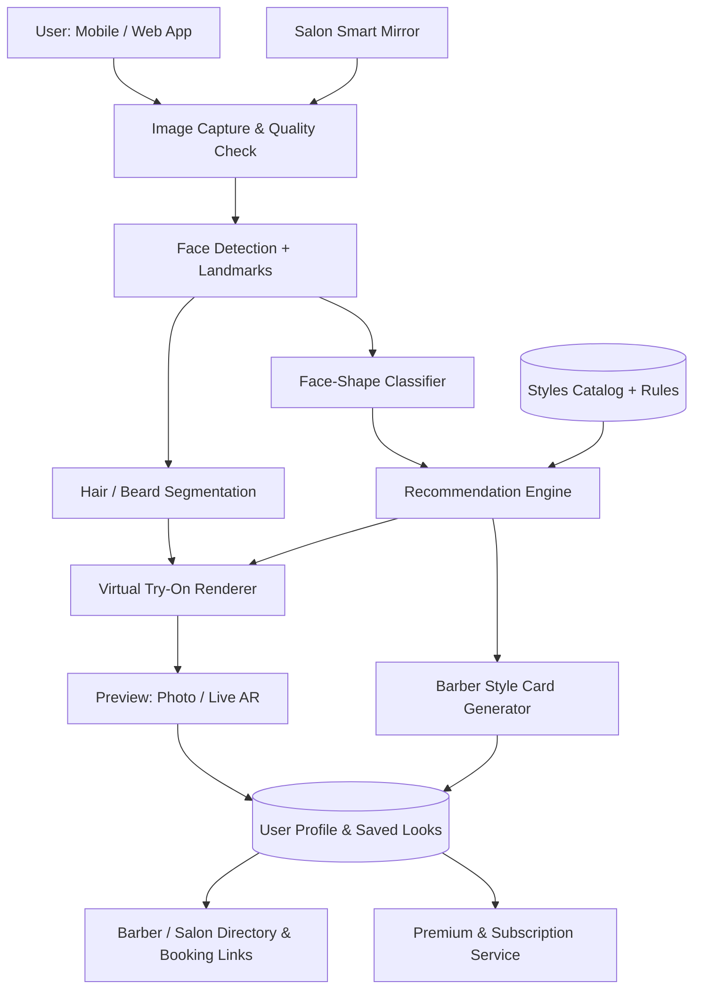

<div align="center">

# 💈 HairSense
### AI Hairstyle & Grooming Recommendation with Virtual Try-On — for Phones *and* Salons

*Final Year Project · Department of Computer Science*


</div>

> **Note:** "HairSense" is a working title. Replace it, the team surnames, university name, and meeting dates marked `TODO` before submission.

---

## 📑 Table of Contents

1. [Project Idea Selection Process](#1-project-idea-selection-process)
2. [Supervisor Meetings](#2-supervisor-meetings)
3. [Background & Justification](#3-background--justification)
4. [Existing Apps & Products (Market Survey)](#4-existing-apps--products-market-survey)
5. [Identified Gaps & How We Cover Them](#5-identified-gaps--how-we-cover-them)
6. [Project Overview](#6-project-overview)
7. [Key Features](#7-key-features)
8. [Dedicated Salon Device (Smart Mirror)](#8-dedicated-salon-device-smart-mirror)
9. [System Architecture](#9-system-architecture)
10. [Proposed Tech Stack](#10-proposed-tech-stack)
11. [Business Model](#11-business-model)
12. [Roadmap](#12-roadmap)
13. [Risks & Limitations](#13-risks--limitations)
14. [Team](#14-team)
15. [References](#15-references)

---

## 1. Project Idea Selection Process

Before finalizing this project, our team brainstormed and evaluated **four candidate ideas**.

### 💡 Idea 1 — Automated End-to-End Data Science Workflow (Multi-Agent System)
A multi-agent system in which the user only defines the **problem and task**, and specialized agents handle the whole data science lifecycle:

| Agent | Responsibility |
|---|---|
| Data Collection Agent | Searches for and gathers relevant datasets |
| Preprocessing Agent | Cleans, transforms, and prepares the data |
| EDA Agent | Performs exploratory data analysis |
| Visualization Agent | Produces charts and insights |
| Training Agent | Selects and trains models |
| Improvement Agent | Tunes hyperparameters and iterates on the results |
| Deployment Agent | Packages and deploys the final model |

### 💡 Idea 2 — FYP Management System
A platform that makes life easier for **supervisors and project managers** by tracking proposals, milestones, meetings, submissions, feedback, and evaluations in one place.

### 💡 Idea 3 — AI Makeup & Skin-Tone Matching + Virtual Try-On
A mobile/web app that:
1. Takes a selfie or uses the live camera.
2. Analyzes skin tone, undertone (warm, cool, neutral, olive), skin type, and facial features.
3. Recommends foundation and concealer shades, lipstick and blush colors, eyeshadow palettes and eyeliner styles, and full looks by occasion (everyday, office, wedding, night out), plus skincare-adjacent tips (e.g., "dewy finishes suit your dry skin").
4. Lets users try products live on their face using AR.
5. Matches shades across brands (e.g., "your Fenty shade is roughly Maybelline X") and links to where to buy.
6. Offers premium features: unlimited try-ons, cross-brand matching, saved looks, personalized routines, and makeup-artist consultations.

### ✅ Idea 4 (SELECTED) — AI Hairstyle & Grooming Recommendation + Virtual Try-On
A mobile/web app that:
1. Takes the user's photo.
2. Uses computer vision to analyze **face shape**.
3. Recommends suitable **hairstyles, beards, mustaches, hair lengths, and grooming styles**.
4. Lets the user **virtually try** those styles on their own face.
5. Optionally recommends products, barbers, and salons.
6. Gives premium users advanced recommendations and unlimited virtual try-ons.

### Why Idea 4 won

| Criteria | Idea 1 | Idea 2 | Idea 3 | **Idea 4** |
|---|:---:|:---:|:---:|:---:|
| Personal motivation from the team | ➖ | ➖ | ➖ | ✅ |
| Real-world, everyday problem | ➖ | ✅ | ✅ | ✅ |
| Strong computer vision + AI component | ➖ | ➖ | ✅ | ✅ |
| Hardware extension possible (salon device) | ➖ | ➖ | ➖ | ✅ |
| Clear monetization (B2C + B2B) | ➖ | ➖ | ✅ | ✅ |
| Demonstrable live demo at FYP defense | ➖ | ✅ | ✅ | ✅ |

---

## 2. Supervisor Meetings

### 🗓️ Meeting 1 — Requesting Supervision
**Date:** `TODO` · **Attendees:** Munib, Usman, Awais, Dr. Hafiz Muhammad Faisal Shahzad

- The team approached **Dr. Hafiz Muhammad Faisal Shahzad** and requested him to become the **Final Year Project supervisor**.
- Outcome: Dr. Faisal agreed to supervise the project and asked the team to come back with well-thought-out project ideas.

### 🗓️ Meeting 2 — Idea Presentation & Selection
**Date:** `TODO` · **Attendees:** Munib, Usman, Awais, Dr. Hafiz Muhammad Faisal Shahzad

- The team presented **all four ideas** (multi-agent data science workflow, FYP management system, AI makeup matching, AI hairstyle & grooming).
- After discussion, **AI Hairstyle & Grooming Recommendation + Virtual Try-On** was selected.
- **Action item from supervisor:** *Study existing apps in this space and identify gaps* that our project can cover. This research is documented in Sections [3](#3-background--justification), [4](#4-existing-apps--products-market-survey), and [5](#5-identified-gaps--how-we-cover-them).

---

## 3. Background & Justification

### 3.1 The Problem We Lived

The idea did not come from a textbook; it came from a barber shop.

**Munib, Usman, and Awais** were sitting in a barber shop, each struggling with the same question: *"Which hairstyle should I choose?"* Explaining a style to a barber is hard, imagining how it will look is harder, and a haircut cannot be undone. Any of us could walk out with a style that did not suit our face.

Around the same time we recalled that **Munib had already received a client request for the same idea in 5th semester**, which told us the problem is real and other people are willing to pay for a solution.

Those two signals, our own experience and a genuine client request, led us to commit to building this project.

### 3.2 Why This Problem Matters

- A haircut is **irreversible in the short term**; a bad one takes weeks to grow out.
- Clients and barbers often **struggle to communicate** what the client wants. One case study from a smart-mirror vendor reports that **95% of hairstylists believe they run a thorough consultation, but only 7% of clients feel they ever received one** ([Visage Technologies / piiq](https://visagetechnologies.com/case-studies/piiq-digital/)).
- Choosing a style by face shape follows established styling rules (jawline contour, length-to-width ratio, cheekbone placement), and these rules can be automated with computer vision ([HaircutAI comparison guide](https://haircutai.app/best-ai-hairstyle-apps)).

### 3.3 How Much Work Has Already Been Done?

A great deal, which validates the demand but also shows where the market is crowded:

- **Consumer apps and websites:** A large ecosystem already exists: YouCam Makeup (Perfect Corp), HaircutAI, CutMuse, Hiface, TryHair AI, HairHunt, Hairstyle Maker, Fotor, BeautyPlus, Glancely, and many more ([Section 4](#4-existing-apps--products-market-survey)).
- **Salon hardware:** Vendors such as Vercon (with piiq software), Orbo, and others already sell smart mirrors and kiosks with virtual hairstyle try-on.
- **Academic research:** Hairstyle transfer, hair segmentation, and strand-level 3D hair reconstruction are active research areas, for example HairPort, StrandHead, and DiffLocks ([References](#15-references)). Research also acknowledges that current methods struggle with large pose changes and complex hair.

### 3.4 Why We Still Chose It

Because the market is crowded, we did **not** choose this project to build "one more try-on filter". We chose it because our survey shows that **important pieces are still unsolved or scattered across separate products** (see Section 5), and because our team has:

1. **First-hand user experience** of the problem.
2. **Real client interest** (5th-semester client request).
3. A project scope that combines **AI/computer vision + mobile/web development + a hardware component**, which suits an FYP well.
4. A path to a **sustainable business** (freemium for users, subscription for salons).

---

## 4. Existing Apps & Products (Market Survey)

> Information below is drawn from public product pages and third-party review articles (listed in [References](#15-references)). Review sites are sometimes written by competitors, so **each claim should be re-verified by installing and testing the app** before we cite it in the final thesis.

### 4.1 Consumer Apps & Web Tools

| App / Tool | Main Strength | Face-Shape Recommendation | Try-On Style | Beard / Mustache | Notable Limits |
|---|---|:---:|---|:---:|---|
| **YouCam Makeup** (Perfect Corp) | Huge style library, hair color, full beauty suite; AI beauty agent announced at CES 2026 | Partial (reports conflict) | Filters / AI generation | ✅ (beard filters in men's simulator) | Broad beauty app, not a grooming-first product; full access is paid |
| **HaircutAI** | 68-point face analysis, 7 face shapes, 182 styles, photorealistic re-render | ✅ | Still-image AI re-render | Not a focus | Still photo only; not a live view |
| **CutMuse** | Recommendations based on visagism; needs a front and a profile photo | ✅ | AI render on your face | ❌ | Paid report, no free tier |
| **Hiface** | Detailed face-shape mesh analysis | ✅ | Analysis-focused | ❌ | Mainly analysis |
| **TryHair AI** | 150+ styles plus face-shape suggestions | ✅ | Still image | Limited | Unlimited use is subscription-based |
| **HairHunt** | Saving, comparing, routine advice, salon visit planner | Partial | Still image | ❌ | One free try-on; most use needs subscription or credits |
| **Hairstyle Maker** | Free grid of 12 cuts, no signup | ❌ | Still image | ❌ | Fixed style sets |
| **Fotor / BeautyPlus** | Quick generative try-on and editing | ❌ (no analyzer) | Still image | Limited | You must already know what you want |
| **Glancely** (iOS) | Face-shape matched cuts and colors | ✅ | Still image | Limited | iOS-first |
| **AI Hair Style Changer** (App Store) | Hair, color and beard try-on plus age "time machine" | ❌ | Still image | ✅ | No recommendation logic |
| **AI Hair Try-On & Color Studio** (App Store) | Claims on-device processing for privacy | ❌ | Still image | ❌ | Subscription for unlimited access |

### 4.2 Salon Hardware & B2B Products

| Product | Form Factor | What It Offers | Observed Limits |
|---|---|---|---|
| **Vercon Smart Barber/Salon Mirror** (with piiq) | Smart mirror, 21.5" touchscreen, Android based | Virtual hairstyle/color try-on, hair diagnosis, in-mirror ordering | Proprietary, sold through OEM/B2B channels; not linked to a user's personal app profile |
| **Orbo Virtual Hair Styler** | Smart mirror, kiosk, tablet, web, or mobile | 1000+ hairstyle database, automated hair mapping | Enterprise product; pricing not public |
| **piiq Digital smart mirror** | Smart mirror | Real-time hair color try-on using hair segmentation | Focused on hair color |
| **ShareTV Barber Shop Magic Mirror** | Smart mirror | Real-time hairstyle, beard, and mustache simulation | Vendor product page; independent quality unknown |
| **hAiR** (Virtual Employee) | Handheld mirror device + app | AI virtual styling, consultation, product suggestions | Announced concept; availability unclear |

### 4.3 What the Research Says About Technical Limits

- Hair is hard: a head has roughly **100,000+ strands**, so realistic rendering is computationally heavy.
- Simple overlays cause hard edges, halos, wrong lighting, and lost strand detail.
- Live AR can **lag or clip through the face or neck**; curly textures often look stiff or "clip-art".
- Generative tools can **subtly change the user's face** (e.g., altered face shape or lowered hairline).
- Diffusion-based models may **inherit bias** and struggle with underrepresented ethnicities and features.
- Many transfer methods **degrade under large head rotation**.

---

## 5. Identified Gaps & How We Cover Them

| # | Gap in Existing Solutions | Our Answer |
|:-:|---|---|
| **G1** | **Recommendation and try-on live in separate products.** Many popular tools only render styles without telling you which suit you; those that analyze usually give still images only. | One pipeline: **analyze → recommend → try on**, with an explanation of *why* each style suits the user. |
| **G2** | **Hair-only focus.** Most tools cover hairstyle or hair color, while beards, mustaches, length, and full grooming are limited or separate. | A unified **grooming profile**: hairstyle + hair length + beard + mustache + trimming style, recommended together. |
| **G3** | **The barber communication gap.** Apps produce a pretty picture, but a barber needs *instructions* (e.g., fade level, top length, side length). | Generate a **barber-ready style card**: the chosen preview image plus text specs and reference angles that can be shown or shared with the barber. |
| **G4** | **Phone apps and salon hardware are disconnected.** Smart mirrors are proprietary B2B products and typically don't share a profile with the customer's own app. | A **dedicated, low-cost salon device** that syncs with the user's account: pick styles at home, walk in, and the mirror already knows your shortlist. |
| **G5** | **Still-image results only in many apps**, so users cannot see side and back views or movement. | **Live camera preview** with head-pose tracking plus multi-angle preview (front/side). |
| **G6** | **Realism and identity drift.** Generative tools may alter the user's face; overlay tools look fake. | Segment and preserve the user's **original face region**; only the hair/beard region is modified. Add a "face preserved" check. |
| **G7** | **Diversity of hair types.** Bias in generative models and stiff rendering of curly or coily hair. | Include hair-type awareness (straight to coily) and test on **South Asian hair types and local barbershop styles** relevant to our target market. *(To be validated with a user survey.)* |
| **G8** | **Privacy.** Users upload face photos to cloud services; only a few tools advertise on-device processing. | **On-device inference by default** for analysis and preview; cloud only for optional heavy generation, with explicit consent and deletion. |
| **G9** | **Local market fit.** Global apps are English-only and not tied to nearby barbers. *(Hypothesis: to be verified.)* | Barber/salon discovery for our region, salon dashboards, and optional **Urdu/English UI**. |
| **G10** | **Paywalls limit exploration.** Many tools offer only a single free try-on or a few credits. | Generous free tier (basic analysis + limited try-ons) and a **salon-sponsored free access** model, since salons pay instead of the customer. |

### Gap Priority (for scoping the FYP)

| Priority | Gaps | Reason |
|---|---|---|
| **Must have (core FYP)** | G1, G2, G3, G6 | Deliver the core academic and product value |
| **Should have** | G4, G5, G8 | Differentiators; the hardware prototype supports G4 |
| **Nice to have** | G7, G9, G10 | Validate through survey and extend if time permits |

---

## 6. Project Overview

**HairSense** is a mobile/web application plus an optional salon smart-mirror that helps men (and later, women) choose a hairstyle and grooming look that suits them, and *see it before committing*.

**In one sentence:** *Take a photo → we detect your face shape → we recommend styles → you try them live → you show the barber exactly what you want.*

### User Journey

```
Selfie / Live Camera
        │
        ▼
Face Detection & Landmarking ──► Face-Shape Classification
        │                                │
        ▼                                ▼
Hair / Beard Segmentation        Style Recommendation Engine
        │                                │
        └───────────► Virtual Try-On ◄───┘
                            │
                            ▼
         Save Look · Barber Style Card · Find Barber/Salon
```

---

## 7. Key Features

### 7.1 Core (Free Tier)
- 📸 Photo upload or live camera capture with quality guidance (lighting, angle)
- 🧠 Face-shape detection (oval, round, square, heart, diamond, oblong)
- ✂️ Recommended hairstyles with a short explanation of why they suit the user
- 🧔 Beard, mustache, and hair-length suggestions
- 🪞 Limited number of virtual try-ons per day
- 💾 Save favorite looks

### 7.2 Premium
- ♾️ Unlimited virtual try-ons (including live AR)
- 🎯 Advanced recommendations (hair type, hair density, lifestyle, maintenance level)
- 🧾 **Barber style card** export (image + specs)
- 📅 Style history and comparison ("before/after" and side-by-side)
- 💇 Barber/salon recommendations and booking links
- 🛍️ Product suggestions (styling products, beard oils, etc.)

### 7.3 Salon / Business Tier
- 🪞 Smart-mirror integration
- 👤 Client profiles and style history
- 📊 Salon dashboard (popular styles, consultation time saved)
- 🖼️ Salon portfolio: barbers can upload their own real haircut work to the catalog

---

## 8. Dedicated Salon Device (Smart Mirror)

Beyond the app, we plan to build a **prototype dedicated device for salons** so customers can preview styles at the chair without needing their own phone.

### Concept
A mirror-style display with a camera, running our on-device models, that shows the customer a live preview of the recommended styles and sends the final style card to the barber.

### Proposed Prototype Hardware *(to be finalized after benchmarking)*

| Component | Options Under Consideration |
|---|---|
| Compute | Raspberry Pi 5 / NVIDIA Jetson Nano-class board / Android tablet |
| Camera | Wide-angle HD USB camera |
| Display | 21"–24" monitor behind a two-way mirror or a tablet |
| Lighting | Adjustable LED ring/strip for consistent lighting |
| Connectivity | Wi-Fi to sync with the cloud and the customer's app account |

### How It Differs From Existing Smart Mirrors
- Syncs with the customer's **personal HairSense profile** (G4).
- Aims to be **lower cost and open**, built from commodity parts.
- Produces the **barber style card** on the spot (G3).
- Runs the **same models as the phone app**, keeping a single codebase.

> **Fallback plan:** if hardware integration proves too time-consuming, the device will run as a **tablet/kiosk web app** to demonstrate the same workflow.

---

## 9. System Architecture



### Module Summary

| Module | Purpose |
|---|---|
| Capture & Quality Check | Ensures the face is frontal, well lit, and not covered |
| Face Analysis | Landmark detection and face-shape classification |
| Recommendation Engine | Rule-based styling knowledge combined with ML ranking |
| Segmentation | Isolates hair, beard, and face regions |
| Try-On Renderer | Applies the style to the user's photo/live video |
| Barber Style Card | Converts a chosen look into shareable instructions |
| Backend & Accounts | Authentication, storage, subscriptions |
| Salon Portal | Salon dashboard and mirror management |

---

## 10. Proposed Tech Stack

> Tools below are **proposals**; the final choice will follow prototyping and benchmarking.

| Layer | Technology |
|---|---|
| Mobile / Web Frontend | Flutter or React Native; React for the web |
| Face Landmarks | MediaPipe Face Mesh / dlib |
| Face-Shape Classification | Landmark ratios + a lightweight CNN / classical ML (scikit-learn, PyTorch) |
| Hair & Beard Segmentation | U-Net / MediaPipe hair segmentation / SAM-based approaches |
| Try-On Rendering | 2D warping + compositing for live AR; diffusion-based inpainting for high-quality stills |
| On-Device Inference | TensorFlow Lite / ONNX Runtime |
| Backend | FastAPI (Python) |
| Database & Storage | PostgreSQL + object storage (e.g., Firebase / Supabase) |
| Auth & Payments | Firebase Auth, Stripe (or a local payment gateway) |
| Datasets | Public face-shape and hair datasets, plus a self-collected, consented dataset |
| DevOps | GitHub Actions, Docker |

---

## 11. Business Model

| Segment | Free | Premium (B2C) | Salon (B2B) |
|---|---|---|---|
| Face-shape analysis | ✅ | ✅ | ✅ |
| Style recommendations | Basic | Advanced | Advanced |
| Virtual try-ons | Limited/day | Unlimited | Unlimited |
| Live AR | ❌ | ✅ | ✅ |
| Barber style card | ❌ | ✅ | ✅ |
| Saved looks & history | Limited | Unlimited | Client profiles |
| Smart-mirror support | ❌ | ❌ | ✅ |
| Analytics dashboard | ❌ | ❌ | ✅ |

**Revenue streams:** premium subscriptions · salon subscriptions/device sales · sponsored product placements · barber/salon listings and referrals.

---

## 12. Roadmap

| Phase | Timeline | Deliverables |
|---|---|---|
| **1. Research & Planning** | `TODO` | Literature review, market survey, user survey, SRS, finalized scope |
| **2. Data & Models** | `TODO` | Dataset collection, face-shape classifier, segmentation model |
| **3. Recommendation Engine** | `TODO` | Styling rules, ranking, explanation generation |
| **4. Try-On Prototype** | `TODO` | Photo try-on, then live AR try-on |
| **5. App Development** | `TODO` | Mobile/web app, accounts, saved looks, style card |
| **6. Salon Device** | `TODO` | Smart-mirror prototype and app sync |
| **7. Testing & Evaluation** | `TODO` | Model accuracy, user study, performance testing |
| **8. Documentation & Defense** | `TODO` | Final report, demo, presentation |

### Planned Evaluation Metrics
- Face-shape classification accuracy / F1-score
- Segmentation quality (IoU)
- Live try-on frame rate and latency on mid-range phones
- User satisfaction (survey/SUS score) and "barber understood my request" rate
- Face-preservation score (difference between the original and rendered face region)

---

## 13. Risks & Limitations

| Risk | Mitigation |
|---|---|
| Realistic hair rendering is technically hard | Start with 2D compositing, then add generative refinement; be transparent that previews are approximations |
| Face-shape labels are subjective | Use landmark ratios plus a labeled, cross-checked dataset; allow users to override |
| Bias across skin tones and hair types | Collect diverse test data; report metrics by group |
| Privacy of face photos | On-device processing by default, explicit consent, easy deletion |
| Hardware scope creep | Fallback to a tablet/kiosk web version |
| Limited time and compute | Prioritize Must-Have gaps first |

---

## 14. Team

| Name | Role | Contact |
|---|---|---|
| **Munib** `TODO surname` | `TODO` | `TODO` |
| **Usman** `TODO surname` | `TODO` | `TODO` |
| **Awais** `TODO surname` | `TODO` | `TODO` |

**Supervisor:** Dr. Hafiz Muhammad Faisal Shahzad
**Institution:** `TODO`
**Session / Batch:** `TODO`

---

## 15. References

**Apps, products, and market articles**
- Perfect Corp YouCam AI Hairstyle Generator: <https://yce.perfectcorp.com/ai-hairstyle-generator>
- CutMuse, *The 10 Best AI Hairstyle Apps in 2026*: <https://blog.cutmuse.com/en/blog/best-ai-hairstyle-apps-2026-tested-compared>
- Hairstyle Maker, *Best AI Hairstyle Apps Comparison*: <https://www.hairstylemaker.com/best-ai-hairstyle-apps>
- HaircutAI, *Best AI Hairstyle Apps Compared*: <https://haircutai.app/best-ai-hairstyle-apps>
- HaircutAI, *Best Face Shape Hairstyle Apps*: <https://haircutai.app/best-face-shape-hairstyle-apps>
- MenHair, *Best AI Hairstyle Try-On App for Men*: <https://menhair.app/blog/best-ai-hairstyle-try-on-app-for-men-2026>
- Best AI Hairstyle Apps For Men: <https://onpointfresh.com/best-ai-hairstyle-apps-for-men/>
- Pixelbin, *Best AI Hairstyle Changer Tools*: <https://www.pixelbin.io/blog/best-ai-hairstyle-changer-tools>
- AI Hair Try-On & Color Studio (App Store): <https://apps.apple.com/app/id6753914047>
- The Right Hairstyles, *Virtual Hairstyle Try-On Guide*: <https://therighthairstyles.com/how-to-choose-ai-hairstyle-try-on/>
- PiktID, *Virtual Hairstyle Try-On*: <https://piktid.com/blog/virtual-hairstyle-try-on/>

**Salon hardware**
- Orbo Virtual Hair Styler: <https://www.orbo.ai/virtual-hairstyle/>
- Visage Technologies, piiq Digital case study: <https://visagetechnologies.com/case-studies/piiq-digital/>
- Vercon Smart Barber Mirror: <https://verconsmartmirror.com/product/smart-barber-mirror/>
- Vercon Smart Salon Mirror: <https://verconsmartmirror.com/news/smart-salon-mirror/>
- hAiR by Virtual Employee: <https://www.virtualemployee.com/articles/artificial-intelligence/step-into-the-future-of-ai-virtual-hairstyling-with-hair>
- ShareTV Barber Shop Magic Mirror: <https://www.sharetv-int.com/nwdl/33.html>
- AppTask Smart Mirror: <https://apptask.com/apptask-smart-mirror/>

**Research**
- HairPort: In-context 3D-aware Hair Import and Transfer for Images: <https://arxiv.org/html/2606.12562v2>
- StrandHead: Text to Hair-Disentangled 3D Head Avatars: <https://arxiv.org/html/2412.11586>
- DiffLocks: Generating 3D Hair from a Single Image: <https://arxiv.org/pdf/2505.06166>
- Ward et al., *A Survey on Hair Modeling*: <http://gamma.cs.unc.edu/HAIRSURVEY/latest.pdf>
- HairFree (bald texture synthesis): <https://lacuna.tiptreesystems.com/work/hairfree-compositional-2d-head-prior-for-text-driven-360-bald-texture-synthesis/wrk_3752b7d6407b725e21bc6ef1cfbd3114>

---

<div align="center">

**Built with ☕ and a few bad haircuts by Munib, Usman & Awais**
*Supervised by Dr. Hafiz Muhammad Faisal Shahzad*

</div>
